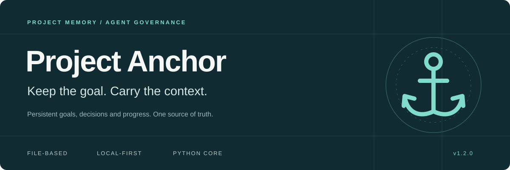
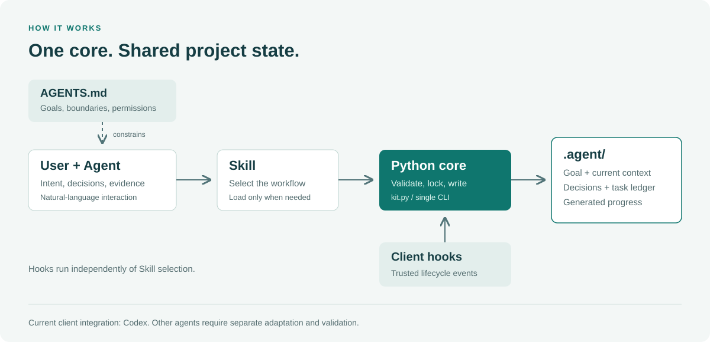
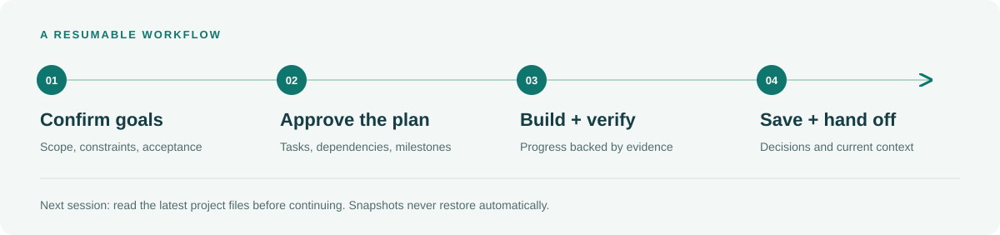

<div align="center">
  

  <p><strong>让长期项目的目标、记忆和进度，有据可查。</strong></p>
  <p>File-based project memory and governance for AI agents.</p>

  <a href="docs/RENAME_VALIDATION.md"></a>
  <a href="pyproject.toml"></a>
  <a href="pyproject.toml"></a>
  <a href="LICENSE"></a>

  <p>
    <a href="#why">为什么需要它</a> ·
    <a href="#architecture">工作原理</a> ·
    <a href="#quick-start">快速开始</a> ·
    <a href="#usage">日常使用</a> ·
    <a href="#validation">验证与边界</a>
  </p>
</div>

---

Project Anchor 为 AI 辅助开发提供一套**随项目保存、可以校验、可以通过 Git 维护的工作记录**。即使对话压缩、会话更换，智能体仍能从项目文件重新读取目标、任务、决策和工作断点。

你表达意图，Skill 选择工作流，Python 执行状态操作；全局规则持续约束行为，Hook 在受支持的生命周期事件中自动运行。

> **当前定位 · v1.2.0 + 未发布的通用 Skill 适配（Draft）**<br>
> Python 核心可以独立运行，不需要安装 Codex。Codex 集成保持不变；新增通用 Skill 安装和 Claude Code 适配。各客户端能力以[能力矩阵](#clients)中的真实验证为准，未验证项不代表可用。

<a id="why"></a>
## 为长项目保留六个锚点

| 你遇到的问题 | Project Anchor 提供的机制 |
| :--- | :--- |
| 对话变长，项目逐渐偏离初衷 | 将目标、约束、非目标和验收条件固定在 `GOAL.md`，接续时读取最新磁盘记录 |
| 改动不断积累，却缺少版本检查点 | 检查 Git 工作区，保留既有修改；提交、推送由用户授权 |
| 看不清任务做到了哪里 | 用唯一任务账本保存状态、依赖和证据，生成可阅读的 `PROGRESS.md` |
| 不知道规则和自动保存是否生效 | 用 `doctor` 分别检查文件、配置、原生发现、信任与执行记录 |
| 规则和经验难以保存、迁移 | 使用文件、安装清单、备份和可重复安装流程；不迁移认证信息 |
| 项目结束，走过的弯路又被遗忘 | 保存决策与已验证教训，生成复盘草案；确认后进入跨项目知识库 |

<a id="architecture"></a>
## 一套核心，四种职责



| 组件 | 职责 | 边界 |
| :--- | :--- | :--- |
| **Skill** | 理解意图、选择流程、调用程序、说明结果 | 按需使用，不要求每条回复调用 |
| **Python 核心** | 校验、写入、任务管理、锁、事务、快照和诊断 | 所有入口复用 `kit.py`，不建立第二份账本 |
| **AGENTS.md** | 持续约束目标、质量、授权和状态维护 | 规则是约束，不能证明模型始终遵守 |
| **Hook** | 在客户端支持的启动与压缩事件中运行 | 不依赖 Skill 被选中；需审核当前定义 |

项目状态保存在目标项目的 `.agent/` 中：

```text
.agent/
├── GOAL.md        已确认目标、约束、非目标与验收条件
├── CURRENT.md     当前阶段、工作断点、阻塞与下一步
├── DECISIONS.md   重要决定及原因
├── LESSONS.md     有证据的经验和失败教训
├── tasks.json     唯一任务账本
├── PROGRESS.md    从账本生成的进度视图
├── state.json     内容哈希、修订号与变更历史
└── runtime/       本地日志、输入草稿和快照，不提交 Git
```

复盘时另生成 `RETRO.md` 草案。受保护状态通过程序修改；`PROGRESS.md` 是展示文件，`tasks.json` 才是任务事实来源。

<a id="quick-start"></a>
## 快速开始

### 1. 安装工具箱

主要验证环境为 **Windows + PowerShell**。准备 Python **3.11+**、Git，以及支持 Skill 和相应 Hook 机制的本地 Codex 客户端。

```powershell
git clone https://github.com/Jakiewbe/Project-Anchor.git
Set-Location Project-Anchor
py -3 --version
py -3 kit.py install-global
```

安装会合并全局规则、配置工具自身的 Hook，并安装用户级 Skill。管理文件更新前会校验、备份；其他 Skill 和非管理配置会保留。当前安装器不修改 `config.toml`。

| 安装内容 | 默认位置 |
| :--- | :--- |
| 用户级 Skill | `~/.agents/skills/project-anchor/` |
| Codex 规则与 Hook 配置 | `CODEX_HOME`；未设置时为 `~/.codex/` |
| 安装清单、备份与运行记录 | `CODEX_HOME/codex-rules/`，保留旧标识以兼容既有安装 |

工具目录需要继续保留：Skill 中的 `runtime.json` 指向实际 Python 和 `kit.py`，没有复制核心程序。移动目录或换电脑后需要重新安装。

**不使用 Codex 时**，按客户端选择一个入口（都复用同一 `kit.py` 和项目 `.agent/`）：

```powershell
py -3 kit.py install-client agents   # 通用 Skill：~/.agents/skills，Cursor、OpenCode 可发现；不写规则或 Hook
py -3 kit.py install-client claude   # Claude Code：~/.claude 下 Skill、rules/project-anchor.md 与两个 Hook
py -3 kit.py doctor --client claude  # 只检查对应安装，不读取 Codex 配置
```

已用 `install-global` 安装到 `~/.agents/skills` 时，Cursor、OpenCode 可直接使用这份 Skill，不要再装 agents。同一目录只允许一个管理方，冲突时拒绝覆盖。卸载用 `uninstall-client`，中断后用 `recover --client`。细节见 [客户端机制](skills/project-anchor/references/CLIENTS.md)。

### 2. 审核 Hook，核对安装

重新打开 Codex 会话，在支持 Hook 的 CLI 中输入 `/hooks`，审核当前 **SessionStart** 和 **PreCompact** 定义，然后运行：

```powershell
py -3 kit.py doctor --native-hooks --native-skills
```

`PASS`、`WARN`、`FAIL`、`UNVERIFIED` 分开报告。文件存在、配置完成、已信任和实际执行是不同的检查层级；出现未验证项不代表全部通过。

### 3. 在目标项目里开始工作

打开你的**业务项目目录**，直接说：

```text
帮我初始化项目管理。
```

确认目标后继续：

```text
根据我的项目目标制定任务草案。
```

自动选择没有确定性保证，需要时可以显式输入（Codex 用 `$project-anchor`，Claude Code、Cursor 用 `/project-anchor`，OpenCode 点名 project-anchor skill）：

```text
$project-anchor 查看当前项目进度，只读，不修改。
```

安装后的全局策略会在明确项目目录首次开展实际工作时检查接入。已有治理记录先读取；只读问答、用户主目录、磁盘根目录和限定单文件工作不自动初始化。接入只创建 `.agent/` 并保留、追加治理约定，**不重建业务工程，不修改业务源码或依赖，不自动初始化 Git**。明确禁止治理写入时不接入。

<a id="usage"></a>
## 用自然语言推进项目



| 场景 | 你可以这样说 |
| :--- | :--- |
| 规划 | “根据目标制定任务草案，列出依赖和验收条件。” |
| 查看进度 | “现在项目进度如何？还有哪些阻塞？” |
| 完成任务 | “将 T1 标记为完成，验收证据是……” |
| 保存决定 | “记录我们刚才确定的技术路线和原因。” |
| 检查目标 | “对照最初目标，检查当前工作是否跑偏。” |
| 切换会话 | “整理工作状态，保存断点，准备切换会话。” |
| 诊断环境 | “检查全局规则、Skill 和 Hook 是否正常。” |
| 项目复盘 | “生成复盘草案，总结已验证的经验和失败原因。” |

任务草案批准后才能开始；完成需要覆盖验收条件的真实证据。顶层目标变更和跨项目知识入库需要用户确认。Python 检查证据的结构与覆盖范围，**不会替你执行验收，也不能判断模型提供的证据是否真实**。

### 会话变更时，记忆如何保留？

- **重要决定发生时**：由智能体识别，并通过程序保存到 `DECISIONS.md`；Hook 无法读取和判断未落盘的聊天决定。
- **压缩前**：受信的 `PreCompact` 保存已经落盘的项目状态快照。
- **启动、恢复或压缩后**：`SessionStart` 提醒读取当前磁盘状态；内容审核有效时才注入项目摘要。
- **继续工作时**：以最新项目文件为准；快照用于检查，不自动覆盖当前状态。

Hook 绑定会话工作目录。在 A 项目的会话里处理 B 项目，不能据此认定 B 的生命周期保护已执行。模型自动选择 Skill、及时记录决定以及长期遵守规则，仍需要实际使用检验。

<a id="clients"></a>
## 客户端能力矩阵

2026-10-09 记录；“已验证”只指有真实客户端证据，来源、版本和原始失败见 [通用适配验证记录](docs/CLIENT_VALIDATION.md)。

| 客户端 | Skill 发现 | 自然语言调用 | 持久规则 | 主动交接 | 生命周期自动化 |
| :--- | :--- | :--- | :--- | :--- | :--- |
| Codex | 已验证（本轮项目级新入口及原生查询） | 部分验证（本轮任务写入与跨客户端读取；完整工作流仍待复验） | 已验证（历史全局 AGENTS.md） | 已验证（历史） | 历史有启动/压缩证据；正式更新未授权，本分支生命周期未复验 |
| Claude Code 2.1.153 | 已验证 | 未验证（本机 API 401） | 未验证（规则文件已安装） | 未验证 | SessionStart 启动/恢复、手动 PreCompact 已验证；压缩后接续、自动压缩未验证 |
| OpenCode 1.14.29 | 已验证（本轮项目级通用安装） | 部分验证（本轮任务添加被权限拒绝；初始化、目标批准与决定保存通过） | 已验证（项目 AGENTS.md；本轮新会话读取通过） | 已验证（历史） | 不支持 |
| Cursor 3.23.12 | 已验证 | 部分验证（Agent 子代理） | 未验证（项目 AGENTS.md） | 部分验证（Agent 子代理） | 不支持 |
| WorkBuddy | 未验证 | 未验证 | 未验证 | 未验证 | 不支持 |

持久规则来自 `init-project` 追加到项目的 AGENTS.md，以及 Claude Code 的用户规则文件；它们不依赖 Skill 每次被选中。“不支持”指本工具未提供该客户端的生命周期适配，不代表客户端自身没有 Hook 能力。主动接续仍需读取最新磁盘状态。

<a id="validation"></a>
## 验证状态与已知边界

以下为 **2026-10-09 已记录的验收结果**。自动测试、协议探针和真实客户端行为分别统计；历史通过不能代替当前版本的生命周期验收。

| 验证层 | 结果 | 说明 |
| :--- | :--- | :--- |
| 独立复核自动回归 | **157 通过 / 0 失败** | 先复跑原 151 项，再新增 6 项证据完整性、异常回合与真实配置变化检查；历史记录保留 |
| 本轮模拟检查 | **3 通过 / 0 失败** | Claude 事件输入、摘要审核、双入口旧修订与旧快照；包含在自动回归中，不额外累加 |
| 本轮真实客户端工作流 | **8 通过 / 1 失败** | OpenCode 首轮 3/1，独立补做 Codex/OpenCode 交替 5/0；被拒绝的任务添加未重跑，交替任务由程序预置 |
| 本轮 Claude 认证检查 | **0 通过 / 1 失败** | 一次请求内部连续 401，120 秒后超时；自然语言及压缩接续仍未执行 |
| 本轮真实配置保持检查 | **首次失败，恢复后通过** | 原生 Codex 自动登记临时项目；只撤销该项并恢复初始完整哈希，未来测试遇到配置变化会失败停止 |
| 通用适配真实客户端 | **OpenCode 8/0；Claude Hook 3/0** | OpenCode 历史运行 4/3、5/2 原样保留；Claude 自然语言因本机 401 未执行 |
| Cursor 子代理与 OpenCode 交替 | **Cursor 10/0；OpenCode 2/0** | 同一项目双向接续、旧修订写入被拒；Cursor 为本仓库工作区内的子代理，不等同用户新开聊天 |
| v1.2.0 自动回归 | **131 通过 / 0 失败** | 包含安装迁移、冲突拒绝、回滚、崩溃恢复和名称校验 |
| v1.2.0 真实 CLI 工作流 | **9 通过 / 1 失败** | 新会话恢复请求发生客户端连接失败，保留原始失败 |
| 隔离原生 Hook 探针 | **3 通过 / 0 失败** | 验证发现、未信任跳过和 Windows 调用协议；不是受信生命周期验收 |
| 独立状态与锁补验 | **4 通过 / 1 失败** | 重复提交相同任务状态仍会成功并增加修订，尚未修复 |
| 历史 Desktop 生命周期 | **有真实执行证据** | 改名前版本验证过启动、手动压缩及一个自然自动压缩样本 |
| Cursor 直接打开项目的新聊天、WorkBuddy、Claude 参与的交替 / 跨平台 / 第二台电脑 | **尚未验证** | 不以通用名称、结构检查或模拟代替真实集成测试 |

**当前需特别注意：**

- v1.2.0 改名后的 Hook 定义在安装验收时未信任，需重新审核；旧版本执行成功不证明新定义已执行。
- 自动选择 Skill 和当回合保存决定均非百分之百可靠；显式入口保留，但不能强制模型始终正确执行。
- 修订冲突会拒绝旧视图写入，必须重新读取并核对意图；当前错误提示还需完善。
- 多轮受控压缩、长期使用和其他客户端支持仍有验收缺口。

完整方法、原始失败说明与版本范围见 [本轮独立复核](docs/CLIENT_VALIDATION.md#independent-review)、[v1.2.0 验证记录](docs/RENAME_VALIDATION.md) 和 [Desktop 验收记录](docs/DESKTOP_ACCEPTANCE.md)。原始运行日志保留在本机，不上传完整聊天或私人配置。

## 文档与源码导航

| 文档 | 内容 |
| :--- | :--- |
| [使用与维护手册](docs/USAGE.md) | CLI 示例、任务证据、快照、备份、迁移、卸载和恢复 |
| [Skill 工作流](skills/project-anchor/references/WORKFLOWS.md) · [CLI 参数](skills/project-anchor/references/COMMANDS.md) | 自然语言意图到正式程序的执行路径 |
| [客户端机制](skills/project-anchor/references/CLIENTS.md) · [通用适配验证](docs/CLIENT_VALIDATION.md) | 各客户端安装位置、规则与生命周期差异，及验证证据 |
| [架构说明](docs/ARCHITECTURE.md) · [故障排查](docs/TROUBLESHOOTING.md) | 实现约束与错误处理 |
| [验证记录](docs/VALIDATION.md) · [Skill 验证](docs/SKILL_VALIDATION.md) · [冒烟检查](SMOKE_TEST.md) | 不同阶段的测试方法与证据 |

```text
kit.py                    唯一 CLI 入口
core/                     状态、任务、事务、安装与诊断
skills/project-anchor/    Skill、参考资料与轻量执行入口
global/AGENTS.md           全局行为约定
project-template/         项目治理模板
hooks/                    Codex 与 Claude Code 共用的生命周期脚本
knowledge/                经确认的跨项目知识
tests/                    自动测试与客户端验收工具
docs/                     使用、架构、验证与排错文档
```

运行自动回归：

```powershell
py -3 -X utf8 -m unittest discover -s tests -q
```

提交前检查差异、执行相关检查，并保留失败证据。运行时日志、快照、认证信息和密钥不应提交。客户端适配继续复用现有核心与账本；能力矩阵之外的客户端不承诺可用。

## 许可证

[MIT License](LICENSE)
